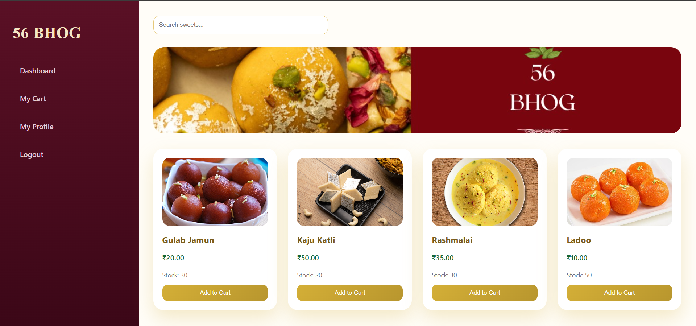
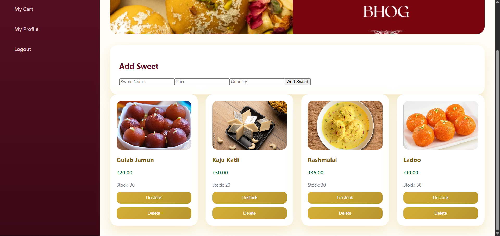
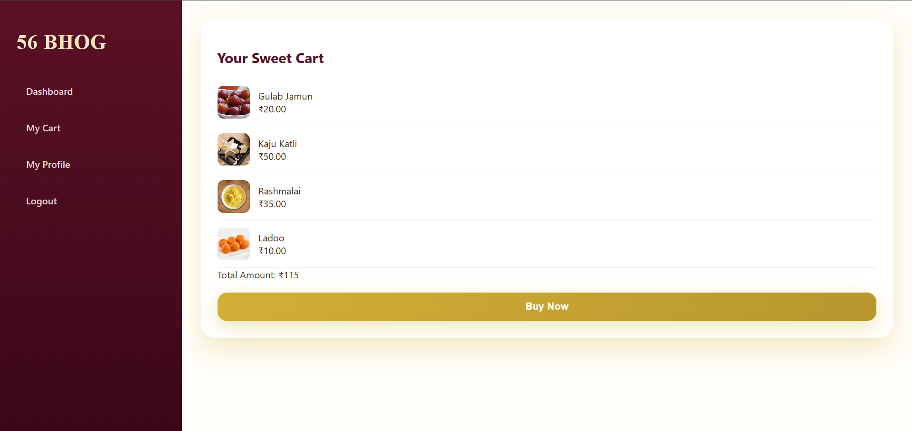

# SWEET_-SHOP_MANAGEMENT_SYSTEM
A full-stack Sweet Shop Management System built using Test-Driven Development (TDD) principles.This project demonstrates clean coding practices, RESTful API design, authentication, inventory management, and a modern single-page application (SPA) frontend.

## Objectives
The goal of this project is to design, build, and test a full-stack Sweet Shop Management System.
This kata evaluates skills in:
- Backend API development
- Database management
- Frontend SPA development
- Authentication & authorization
- Test-Driven Development (TDD)
- Git & version control
- Responsible use of AI tools

## Tech Stack

- Backend  - Node.js + Express.js
- frontend - React , CSS
- DataBase - PostgreSQL
- Authentication - JWT (Token-based authentication)

##  Core Features 

### User Authentication
- User registration
- User login
- JWT-based authentication
- Protected API endpoints

### Sweets Management (Protected APIs)
Each Sweet has:
- ID
- Name
- Price
- Category
- Quantity

#### API Endpoints

#### Auth
- POST '/api/auth/register'
- POST '/api/auth/login'

#### Sweets

- POST '/api/sweets ' → Add a new sweet 
- GET '/api/sweets' → Get all sweets
- GET '/api/sweets/search'→ Search by name, category, or price range
- PUT '/api/sweets/:id ' → Update sweet details
- DELETE '/api/sweets/:id' → Delete sweet (Admin only)

#### Inventory

- POST '/api/sweets/:id/purchase' → Purchase a sweet (decrease quantity)
- POST '/api/sweets/:id/restock' → Restock a sweet (Admin only)


## Frontend Application (SPA)
A modern single-page application that interacts with the backend API.

### Functional Requirements
- User registration & login
- Dashboard showing all available sweets
- Search and filter sweets
- Purchase button on each sweet
  - Disabled when quantity is zero
- Admin UI to:
  - Add sweets
  - Update sweets
  - Delete sweets
 
### Design Expectations

- Clean and modern UI

- Responsive design

- Good user experience


## AI Usage Policy 
AI tools were used responsibly to assist during development.  
ChatGPT was used for:
- Understanding problem requirements
- Generating boilerplate code and examples
- Writing and reviewing test cases
- Debugging and refactoring suggestions
- Improving README documentation

## SetUp Instructions: 
### prequisites
- Node.js
- postgresql

### How to Run the Project

#### Backend
```bash
npm install
npm test
npm run dev
```

##### Frontend
```bash
npm install
npm start
```

## Screenshots: 

### Login Page


### Dashboard


### Add Sweet (Admin)


### Cart 


### My Profile


### Test


### Register Page


  


